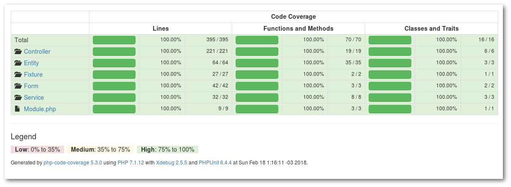

# Candidato

**Nome**: Andre Cardoso

**Email**: andrecardosodev@gmail.com

# Detalhes

Preferi criar a aplicação com o Zend Framework 3 para ganhar tempo e demonstrar outros skills 
como reaproveitamento de código, Docker, testes unitários (com cobertura de 100%) e interações em tempo real.



Segue um resumo do que utilizado no projeto:

- Docker
- Zend Framework 3
- Doctrine ORM
- Firebase (PHP e JavaScript)
- Migrations
- Data Fixtures
- Testes Unitários (PHPUnit)
- CSS Bootstrap padrão do ZF3
- jQuery
- jQuery Price Formatter
- jQuery Datetime picker

# Instalação

Baixe o repositório no branch `andre-cardoso` e rode o comando `composer install`. Caso 
não de certo com o install, dê um update: `composer update`.

> Caso haja questionamento sobre incluir módulos em arquivo de configuração, basta rejeitar. Tudo que 
a aplicacão precisa pra rodar já está registrado corretamente.

Assim que a instalação das dependências finalizar siga os passos abaixo.


## Passo 1 - Criando o banco de dados

Crie um novo banco de dados MySQL. Sugestão de nome: `sae_andre_cardoso`. 

```shell
$ mysql -u {user} -p
mysql> CREATE SCHEMA `sae_andre_cardoso` DEFAULT CHARACTER SET utf8 COLLATE utf8_unicode_ci ;
```

Em seguida configure o 
arquivo `config/autoload/doctrine-module` com as informações do banco recém criado.

```php
# config/autoload/doctrine_orm.global.php

return [
    'doctrine' => [
        'connection' => [
            'orm_default' => [
                'driverClass' => 'Doctrine\DBAL\Driver\PDOMySql\Driver',
                'params' => [
                    'host' => 'localhost',
                    'port' => '3306',
                    'user' => 'user',
                    'password' => 'password',
                    'dbname' => 'sae_andre_cardoso',
                    'driverOptions' => [
                        PDO::MYSQL_ATTR_INIT_COMMAND => "SET NAMES 'UTF8'"
                    ]
                ]
            ]
        ]
    ],
];

```

## Passo 2 - Executando Migrations

Antes de tudo temos de habilitar o modo desenvolvimento para poder 
realizar as migrações e fixtures. Rode o seguinte comando: `composer development-enable`.

```shell
$ composer development-enable
> zf-development-mode enable
You are now in development mode.
```

Agora que já estamos em modo desenvolvimento, banco de dados já existe e a configuração para sua correta conexão está ok, 
é o momento de criar as tabelas. Para tal, utilizei o Doctrine Migrations (você pode saber mais sobre 
migrations com o Doctrine em um artigo que escrevi em meu blog - [link](https://andrebian.com/doctrine-migrations-com-zend-framework)).

Em resumo, o comando a ser executado é o `./vendor/bin/doctrine-module migrations:migrate --no-interaction`.


## Passo 3 - Executando Fixtures

Por padrão já cadastrei 3 eventos/espetáculos, basta rodar as fixtures que a aplicação estará pronta para uso. 
Rode o comando `./vendor/bin/doctrine-module orm:fixtures:load`.


```shell
$ ./vendor/bin/doctrine-module orm:fixtures:load
Careful, database will be purged. Do you want to continue y/N ?y
  > purging database
  > loading [0] Application\Fixture\LoadEvent
```

## Passo 4 - Inicializando o Firebase

Para esta aplicação utilizei a seleção de poltronas em tempo real com o 
Firebase Realtime database (que também falo [aqui]() como funciona). Para isso 
é necessário que a base seja inicializada, basta um simples comando: `php public/index.php init-firebase`.

```shell
$ cd <project_root>
$ php public/index.php init-firebase

Adicionando 3 eventos no firebase.

Feito. Agora a selecao das poltronas sera em TEMPO REAL!!!
```

## Passo 5 - Rode o Built-in Server

Agora basta rodar o comando `php -S localhost:8080 -t public`. Adicionalmente existe um script registrado no composer.json 
pra facilitar a disponibilização do web server de testes: `composer serve`

```shell
$ php -S localhost:8080 -t public
```

Resultado


## Com o Docker

Rode o comando `docker-compose up -d --build`.


Em seguida entre no container `docker-compose exec sae-desafia-andre-cardoso bash` e siga os passos **2**, **3** e **4**.


Feito isto, basta acessar `http://localhost:8080` em seu browser.

# Observações

A aplicação foi criada com o [Firebase Realtime Database](https://firebase.google.com/docs/database/), isso proporciona 
uma experiência muito agradável.

Quando um visitante seleciona as poltronas e clica em reservar, as mesmas entram 
em estado de pré-reserva. Todos os visitantes que estejam visualizando o mesmo evento, terão 
as poltronas alteradas, impossibilitando as mesmas de serem selecionandas.

Ao confirmar a reserva das poltronas, todos os visitantes tem o status das mesmas 
alterados em tempo real.

O mesmo ocorre para o admin, que vê em tempo real as pré-reservas e confirmações, 
bem como pode cancelar uma reserva ou pré-reserva. Quando o admin cancela uma 
reserva ou pré-reserva, os visitantes que estão na tela do evento tem 
as poltronas liberadas para seleção.

# Testes

Para rodar os testes, utilize o comando `composer test`. Toda a suíte de 
testes será executada e, estando o Xdebug instalado, será gerado o 
resultado do coverage na pasta `build/coverage-html`. Abra o arquivo 
`build/coverage-html/index.html` em seu navegador.

```shell
$ composer test
> phpunit
PHPUnit 6.4.4 by Sebastian Bergmann and contributors.

..........................................                        42 / 42 (100%)

Time: 7.61 seconds, Memory: 28.00MB

OK (42 tests, 155 assertions)

Generating code coverage report in HTML format ... done

```

Não tem o Xdebug instalado? Simples, rode pelo docker!

Primeiro entre no container: `docker-compose exec -u me sae-desafia-andre-cardoso bash`.

Em seguida rode os testes: `composer test`


Comando completo:

```shell
$ docker-compose exec -u me sae-desafia-andre-cardoso bash

me@sae-desafia-andre-cardoso:/var/www$ composer test

## Provavelmente dará erro de permissão, mas pode ignorar

> phpunit
PHPUnit 6.4.4 by Sebastian Bergmann and contributors.

..........................................                        42 / 42 (100%)

Time: 42.22 seconds, Memory: 28.00MB

OK (42 tests, 155 assertions)

Generating code coverage report in HTML format ... done
me@sae-desafia-andre-cardoso:/var/www$
```

Por que rodar com o parâmetro `-u me`? Porque ao rodar os testes, diversos 
arquivos são criados em `build/coverage-html` e não estando presente o 
parâmetro `-u me` os mesmos serão criados pelo root. Logo, para os 
remover ou sobrescrever na próxima vez que os testes rodarem, somente 
o root terá as permissões.